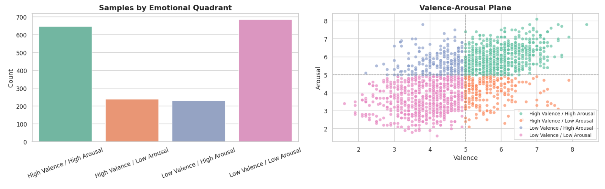
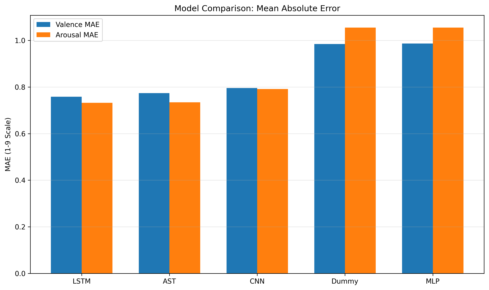
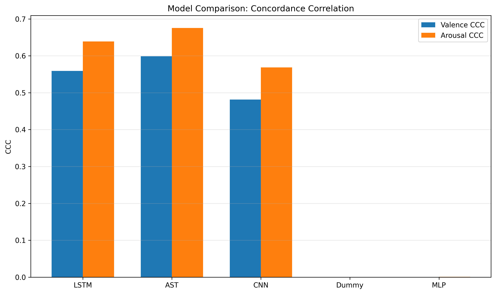
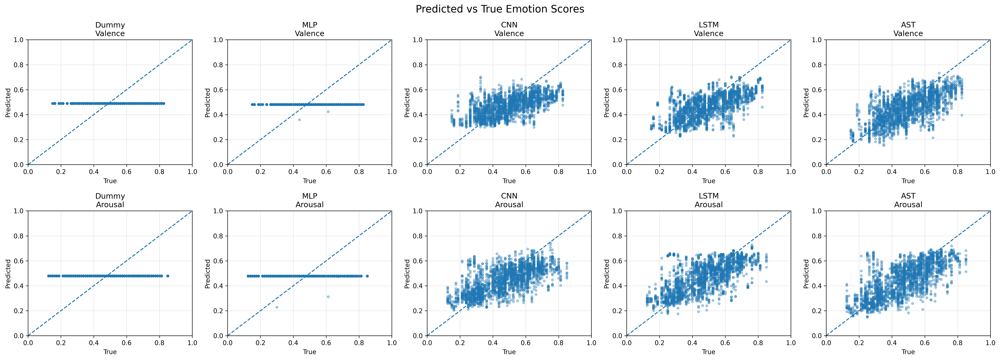
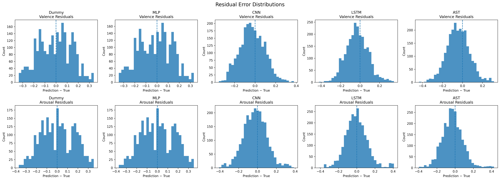

# 🎵 Music Emotion Recognition

> **Can a model learn the emotional shape of music—not just predict the average song?**

```text
                              MUSIC
                                │
                                ▼
                       ┌─────────────────┐
                       │  Audio loading  │
                       │  Mono conversion│
                       │  Mel extraction │
                       └────────┬────────┘
                                │
                                ▼
                     Normalized 128 × 1,024 chunks
                                │
                    ┌───────────┴───────────┐
                    ▼                       ▼
              VALENCE                  AROUSAL
       negative ◄──────► positive   calm ◄──────► energetic
```

This project predicts the continuous emotional characteristics of music from audio: **Valence** (pleasantness/positivity) and **Arousal** (energy or activation). The workflow uses the DEAM song-level annotations, converts audio into normalized mel-spectrogram chunks, and compares a constant-mean baseline with an MLP, CNN, bidirectional LSTM, and pretrained Audio Spectrogram Transformer (AST). On the exported test evaluation, the LSTM achieved the lowest overall error, while AST produced the strongest correlation and concordance on both targets.

| Data | Representation | Models | Evaluation |
|---|---|---|---|
| 1,802 unique songs | 128-bin mel spectrograms | Dummy · MLP · CNN · BiLSTM · AST | 2,430 held-out chunks |

**Selection:** LSTM for lowest error · AST for strongest agreement.

---
## 🚀 Live Demo

🔗 **Try the deployed application:** https://music-emotion-detection-ast.streamlit.app/


## Project Highlights

- 1,802 unique DEAM songs with complete audio paths and song-level Valence/Arousal annotations.
- Leak-free song-level train/validation/test splitting with `random_state=42`.
- Mono audio, 44.1 kHz mel-spectrogram extraction, training-only normalization, and fixed-size chunking.
- Comparison of five approaches: Dummy, MLP, CNN, bidirectional LSTM, and pretrained AST.
- Final evaluation on 2,430 held-out chunks using MAE, MSE, RMSE, R², Pearson correlation, CCC, bias, and error standard deviation.
- Exported metrics, predictions, comparison plots, residual diagnostics, and emotion-space visualizations are available in `final_metrics/` when included in the repository.

## 🧠 Problem Statement

Music emotion recognition estimates where a song lies in a continuous affective space. Valence describes how positive or negative the perceived emotion is; Arousal describes how calm or energetic it is. Because both labels are numerical ratings rather than mutually exclusive categories, this project treats the task as **multi-output regression**, predicting `[Valence, Arousal]` together.

The DEAM annotations use a 1–9 scale. Training and exported metrics use the normalized range 0–1, with conversion `normalized = (rating - 1) / 8`.

## 📊 Dataset and Exploratory Data Analysis

<p align="center">
  
</p>

The EDA notebook loads the DEAM static song-level annotation files and the corresponding MEMD audio files:

- 1,802 rows and 1,802 unique song IDs were analyzed.
- No duplicate rows, duplicate song IDs, missing values, or unresolved audio paths were reported in the EDA run.
- Valence: mean `4.90`, median `4.90`, range `1.60–8.40` on the original 1–9 scale.
- Arousal: mean `4.81`, median `4.90`, range `1.60–8.10`.
- Valence and Arousal had Pearson correlation `0.5700`: related, but not interchangeable targets.
- The largest exploratory quadrant was **Low Valence / Low Arousal**, containing `38.1%` of analyzed songs.
- In the 25-file audio sample, mean duration was `54.81 s`, median duration was `45.00 s`, and the most common sample rate was `44,100 Hz`.

The EDA also inspects target distributions, the Valence–Arousal plane, representative waveforms, mel-spectrograms, and dynamic annotation traces. These views matter because they connect the numerical labels to the acoustic representation and show why a continuous, two-dimensional target is appropriate. The quadrant view is descriptive only; the model is not trained as a four-class classifier.

## ⚙️ Audio Preprocessing Pipeline


```text
Audio file
   ↓
Load with torchaudio
   ↓
Convert to mono
   ↓
Resample/represent at 44,100 Hz
   ↓
128-bin mel spectrogram
   ↓
Amplitude-to-dB conversion
   ↓
Keep the first 9,830 time frames
   ↓
Normalize with mean/std computed from the training split only
   ↓
Keep 9,216 frames and split into nine 1,024-frame chunks
   ↓
Model input: [1, 128, 1,024]
```

The code first computes spectrogram normalization statistics from eligible training songs, then applies those statistics to the data. Each song-level label is copied to its nine chunks. This makes long recordings manageable and provides a fixed input shape, while the song-level split prevents chunks from the same song appearing across train, validation, and test partitions.

## 🏗️ Models


### Audio Spectrogram Transformer (AST)

Uses `MIT/ast-finetuned-audioset-10-10-0.4593` through `transformers.ASTModel`. Mean-pooled transformer representations feed a regression head of `hidden_size → 128 → 2`, with ReLU and 0.2 dropout. It tests transfer learning from an audio transformer pretrained on AudioSet.

### Bidirectional LSTM

Reinterprets each chunk as a sequence of 1,024 time steps with 128 mel features per step. A two-layer bidirectional LSTM with hidden size 256 processes the sequence; mean pooling over time feeds a 128-unit layer, 0.3 dropout, and the two-target head. It tests temporal structure across the chunk.

### CNN

Uses three convolutional blocks with channels `32 → 64 → 128`, each followed by `2 × 2` max pooling. The flattened representation passes through a 256-unit layer with 0.5 dropout and a two-unit output head. It tests local time–frequency pattern extraction.

### MLP

Flattens the `128 × 1,024` spectrogram, then uses fully connected layers of 512 and 128 units with ReLU activations and 0.5 dropout before the two-value regression head. It tests a non-spatial baseline that treats the spectrogram as one vector.

### Dummy baseline

Predicts the training-set mean Valence and mean Arousal for every test chunk. It establishes how much performance comes from learning audio-dependent variation rather than reproducing the central tendency.


## 🧪 Experimental Setup

- **Split:** song IDs were split into 70% train and 30% temporary data, then the temporary data was split evenly into validation and test; both operations used `random_state=42`.
- **Input:** preloaded normalized tensors shaped `[1, 128, 1,024]`; batch size `16`.
- **Targets:** two normalized regression values, Valence and Arousal.
- **Loss:** mean squared error (`MSELoss`).
- **Optimizer:** Adam with learning rate `1e-4` for the trained neural models.
- **Training:** 10 epochs; AST and the LSTM/MLP runs use mixed-precision training in the notebook. Validation loss is reported each epoch, but the notebook does not implement early stopping.
- **Evaluation:** the exported artifacts evaluate 2,430 held-out chunks. Metrics are computed per target and overall, on the normalized 0–1 scale; MAE/MSE/RMSE are also converted to the original 1–9 scale where exported.

## 📈 Results

<p align="center">
  
  
</p>

Final values below come from `final_metrics.csv` in `final_metrics.zip`. Errors are on the normalized 0–1 target scale; CCC, Pearson, and R² are unitless.

| Model | Valence MAE | Arousal MAE | Valence CCC | Arousal CCC | Valence Pearson | Arousal Pearson | Overall MAE |
|---|---:|---:|---:|---:|---:|---:|---:|
| LSTM | 0.0947 | 0.0916 | 0.5590 | 0.6389 | 0.6282 | 0.6650 | **0.0931** |
| AST | 0.0967 | **0.0917** | **0.5986** | **0.6756** | **0.6539** | **0.7011** | 0.0942 |
| CNN | 0.0995 | 0.0989 | 0.4814 | 0.5684 | 0.5837 | 0.6320 | 0.0992 |
| Dummy | 0.1230 | 0.1319 | ~0.0000 | ~0.0000 | — | — | 0.1275 |
| MLP | 0.1233 | 0.1318 | ~0.0000 | ~0.0006 | 0.0008 | 0.0081 | 0.1276 |

For reference, LSTM overall RMSE is `0.1193` normalized (`0.9544` on the 1–9 scale), and AST overall RMSE is `0.1199` normalized (`0.9594` on the 1–9 scale).

## 🔍 Beyond Error Metrics: What Did the Models Actually Learn?

<p align="center">
  
  
</p>

The evaluation shows a meaningful distinction between average error and agreement with the target variation:

- **LSTM is the lowest-error model overall.** It has the best overall MAE (`0.0931`), and the best Valence MAE (`0.0947`) and Arousal MAE (`0.0916`).
- **AST tracks target variation most strongly.** It has the highest Pearson correlation and CCC for both Valence and Arousal. Its Arousal R² (`0.4437`) is also higher than LSTM’s (`0.4336`), while its Valence R² (`0.3227`) is lower than LSTM’s (`0.3483`).
- **CNN learns useful local structure but trails the sequence/transformer models.** Its correlations and CCC values are positive and materially above the Dummy and MLP baselines, but its errors are higher.
- **The MLP is effectively a collapse-to-the-mean baseline in this experiment.** Its near-zero Pearson/CCC and slightly negative R² indicate that flattening the spectrogram did not recover useful target variation under this setup. The exported Dummy baseline is similarly non-correlating, as expected.
- **Bias is not zero for the strongest models.** LSTM Valence bias is `-0.0314`, while AST Valence bias is `-0.0444`; on normalized targets, these negative values indicate average underprediction for Valence. This is one reason CCC is useful alongside MAE: CCC reflects both association and agreement, including location/scale mismatch.

The supplied `prediction_vs_true.png`, `residual_distributions.png`, `mae_vs_ccc.png`, and `emotion_circumplex_comparison.png` provide the corresponding visual diagnostics. They should be read together with the exported CSV/JSON rather than treated as substitutes for the numerical evaluation.

## 🏆 Final Model Selection

Based on the final exported evidence, **LSTM is selected as the primary model for this project** because it has the lowest overall MAE, MSE, and RMSE and the best per-target MAE. This is a practical choice when average prediction error is the main objective.

AST is a strong alternative when preserving target variation and agreement is more important: it has higher Pearson correlation and CCC for both outputs, plus slightly better Arousal R². The results therefore support a nuanced conclusion: **LSTM wins the error-based selection; AST wins the agreement-based diagnostics.** The artifacts do not establish statistical significance, so the README does not claim that the observed differences generalize beyond this test set.

## 🗺️ Emotion Interpretation

The predicted pair can be interpreted on the Valence–Arousal plane. The quadrant labels are descriptive, with 5.0 as the neutral dividing point on the original 1–9 annotation scale:

```text
                        High Arousal
                             ↑
       Low Valence           |           High Valence
       / High Arousal        |           / High Arousal
                             |
       ----------------------+----------------------→ Valence
                             |
       Low Valence           |           High Valence
       / Low Arousal         |           / Low Arousal
                             ↓
                        Low Arousal
```

## 💻 Running the Project

### Installation

```bash
git clone <repository-url>
cd <repository-name>
pip install -r requirements.txt
```

The notebooks were written for a Kaggle-style environment and expect the DEAM audio and annotation files under `/kaggle/input/...`. Update the dataset paths for a local environment, or attach the DEAM dataset in Kaggle.

### Reproduce the workflow

1. Run `music-eda.ipynb` to inspect labels, target distributions, the emotion plane, and representative audio.
2. Run `music-models.ipynb` to create song-level splits, compute training-only normalization statistics, extract chunks, train the models, and export weights/predictions.
3. Run the final evaluation cells to generate the `final_metrics/` artifacts.

### Practical inference

For a new song, apply the same preprocessing and normalization pipeline, retain the same `128 × 1,024` chunk shape, run the selected model on each chunk, and aggregate the chunk predictions (for example, by averaging them) to obtain one Valence/Arousal estimate for the recording. The supplied notebooks demonstrate model evaluation on chunks; a production inference wrapper should preserve the exact training preprocessing and model definition.

## 📁 Exported Evaluation Artifacts

The supplied archive contains:

- `final_metrics.csv` and `final_metrics.json` — per-model, per-target, and overall metrics.
- `all_model_predictions.csv` — ground truth and predictions for every evaluated model.
- `mae_comparison.png`, `ccc_comparison.png`, `r2_comparison.png`, and `mae_vs_ccc.png` — comparison plots.
- `prediction_vs_true.png`, `residual_distributions.png`, and `emotion_circumplex_comparison.png` — diagnostic plots.
- `experiment_info.json` — dataset, target range, model list, evaluation count, and metric list.

## ⚠️ Reproducibility Notes

The notebooks define the split seed and preprocessing values, but the supplied materials do not record a complete hardware/software lockfile or a full random-seed policy for every framework component. Exact numerical reproduction may therefore depend on the execution environment and library versions. The final exported archive remains the authoritative source for the reported metrics.

## 📚 References

- DEAM: Database for Emotional Analysis in Music.
- Gong et al., *AST: Audio Spectrogram Transformer*.
- Lin, H. et al., Concordance Correlation Coefficient for agreement analysis.
